# 相机接入层深度解析：ONVIF 发现、认证与 RTSP 拉流

> **摘要**：本文系统梳理 IP 网络摄像头接入层的完整技术栈——从设备自动发现（ONVIF / WS-Discovery）、身份认证（WS-UsernameToken / HTTP Digest），到媒体会话建立（RTSP）与实时数据传输（RTP/RTCP）。每个环节均基于原始规范文档，配合协议交互图、状态机和报文示例，力图让读者真正理解"接摄像头"这件事在协议层面究竟发生了什么。

---

## 目录

1. [背景：为什么 IP 摄像头接入如此复杂？](#1-背景为什么-ip-摄像头接入如此复杂)
2. [ONVIF 标准：历史、架构与 Profile 体系](#2-onvif-标准历史架构与-profile-体系)
3. [ONVIF 设备发现：WS-Discovery 协议详解](#3-onvif-设备发现ws-discovery-协议详解)
4. [ONVIF 认证机制：从 WS-UsernameToken 到 HTTP Digest](#4-onvif-认证机制从-ws-usernametoken-到-http-digest)
5. [RTSP 协议：多媒体流的"远程遥控器"](#5-rtsp-协议多媒体流的远程遥控器)
6. [RTP 与 SDP：媒体数据的传输与描述](#6-rtp-与-sdp媒体数据的传输与描述)
7. [完整接入流程：从零到拉流](#7-完整接入流程从零到拉流)
8. [工程实践：常见问题与调试方法](#8-工程实践常见问题与调试方法)
9. [参考资料](#9-参考资料)

---

## 1. 背景：为什么 IP 摄像头接入如此复杂？

### 1.1 模拟摄像头时代的终结

在 2000 年代初期，监控摄像头主要是模拟摄像头，通过同轴电缆将模拟视频信号传输至硬盘录像机（DVR）。这套体系简单，但有致命缺陷：布线成本高、传输距离有限、分辨率受限于 PAL/NTSC 制式（最高约 0.4 MP）、且设备之间无法互通（每家厂商有各自的私有协议）。

IP 摄像头（IPC，IP Camera）的兴起彻底改变了这一局面。IPC 将图像传感器、视频编码器（H.264/H.265）和网络接口集成于一体，通过标准以太网传输，理论上可复用现有的网络基础设施。但这也带来了新的挑战：

- **互通性问题**：2008 年前，Axis、海康威视、大华等厂商各自定义私有 API（Axis VAPIX、海康 SDK 等），系统集成商必须为每家厂商单独开发适配层，成本极高。
- **发现问题**：在大型场所中，数百台摄像头分布在各个角落，如何自动发现它们的 IP 地址和服务地址？
- **认证问题**：设备级的认证如何在不暴露明文密码的情况下安全地完成？
- **流媒体问题**：视频数据如何从摄像头高效地传输到 VMS（视频管理系统）或客户端？

这三个问题的答案，分别对应本文的三个核心主题：**ONVIF 发现、ONVIF 认证、RTSP 拉流**。

### 1.2 一次完整接入的鸟瞰

在深入细节之前，先从高层次理解整个接入流程：

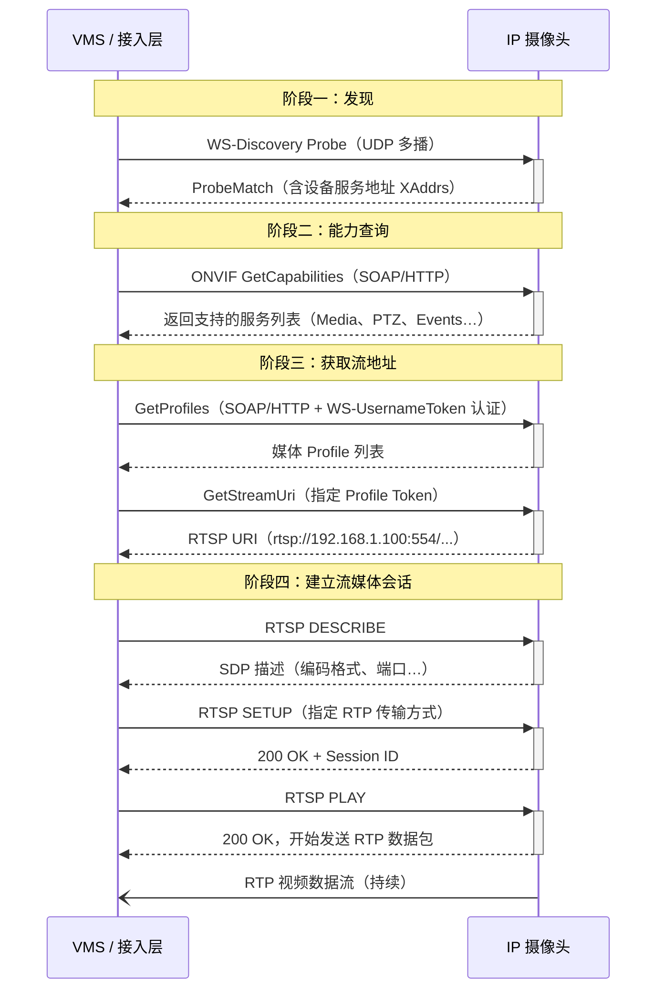

---

## 2. ONVIF 标准：历史、架构与 Profile 体系

### 2.1 ONVIF 的诞生：三家厂商的握手

ONVIF（Open Network Video Interface Forum，开放网络视频接口论坛）的创立背景是 IP 监控市场日益严重的碎片化问题。

2008 年 5 月，Axis Communications、Bosch Security Systems 和 Sony Corporation 宣布合作，共同创建一个全球开放论坛，为网络视频产品开发统一的网络接口标准，即 ONVIF（Open Network Video Interface Forum）。

ONVIF 于 2008 年 11 月 25 日正式注册为非营利性特拉华州 501(c)6 公司。

在成立之初，ONVIF 的野心是显而易见的：到 2008 年底，ONVIF 就已发布了核心规范（Core Specification）和测试规范（Test Specification）的第一版，内容涵盖本地和远程设备发现、设备管理、图像配置、媒体配置、音视频实时流、事件处理、视频分析以及 PTZ（Pan/Tilt/Zoom）控制。

### 2.2 ONVIF Profile 体系：从 S 到 T 的演进

Profile 是 ONVIF 将规范打包为可声明合规的产品特性集的机制。每个 Profile 定义了一组强制（mandatory）和条件性（conditional）功能。

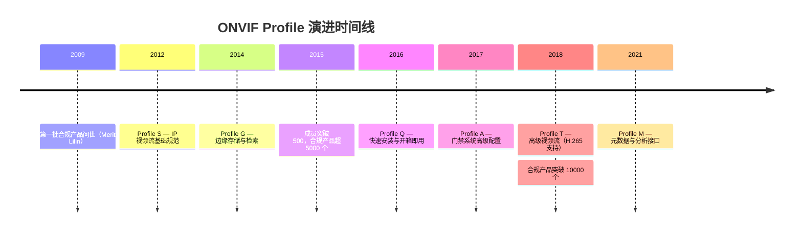

各 Profile 的主要功能对比：

| Profile | 发布年份 | 核心用途 | 关键能力 |
|---------|---------|---------|---------|
| **S** | 2012 | 基础视频流 | RTSP 推流、PTZ 控制、音频、多播 |
| **G** | 2014 | 边缘存储 | 录像配置、回放检索、存储管理 |
| **C** | 2013 | 门禁控制 | 门禁配置、事件/报警管理 |
| **Q** | 2016 | 快速安装 | 零配置发现、TLS 安全配置 |
| **T** | 2018 | 高级视频流 | H.264/H.265、HTTPS 流、元数据 |
| **M** | 2021 | 分析元数据 | 对象分类、人员/车辆元数据 |

> **注意**：ONVIF 已宣布计划于 2026 年退役 Profile S，鼓励用户迁移到 Profile T 以获得更强的互操作性和更好的网络安全支持。

### 2.3 ONVIF 的技术架构

ONVIF 的本质是一套基于 Web Services 标准的服务框架。ONVIF 的管理和控制接口被描述为 Web Services，标准中包含完整的 XML Schema 和 WSDL（Web Services Description Language）定义。为了实现完整的即插即用互操作性，标准定义了基于 WS-Discovery 的设备发现过程。

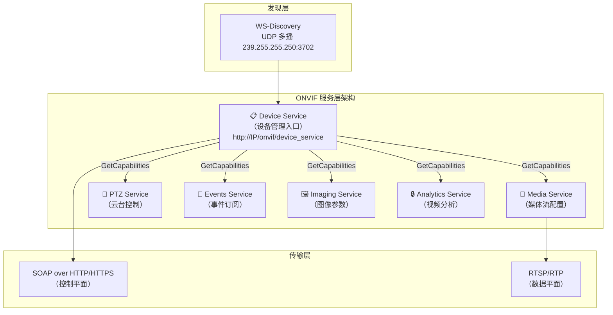

为确保互操作性，所有 ONVIF 服务遵循 WS-I Basic Profile 2.0 规范，并采用 document/literal wrapped 模式进行消息交换。

---

## 3. ONVIF 设备发现：WS-Discovery 协议详解

### 3.1 WS-Discovery 是什么？

设备发现是整个接入层的第一步，也是最容易被工程师忽视的一步（很多人直接硬编码 IP）。

WS-Discovery（Web Services Dynamic Discovery）是一种技术规范，定义了一个多播发现协议，用于在本地网络上定位服务。它运行在 TCP 和 UDP 的 3702 端口上，使用 IP 多播地址 `239.255.255.250`（IPv4）或 `ff02::c`（IPv6），节点间通信基于 SOAP-over-UDP。

WS-Discovery 通常受到网络分段的限制，因为多播包通常不会穿越路由器。 这意味着发现只在同一个二层网络（VLAN/子网）内生效，这是部署时需要特别注意的约束。

### 3.2 发现的两种模式

WS-Discovery 定义了两种工作模式：

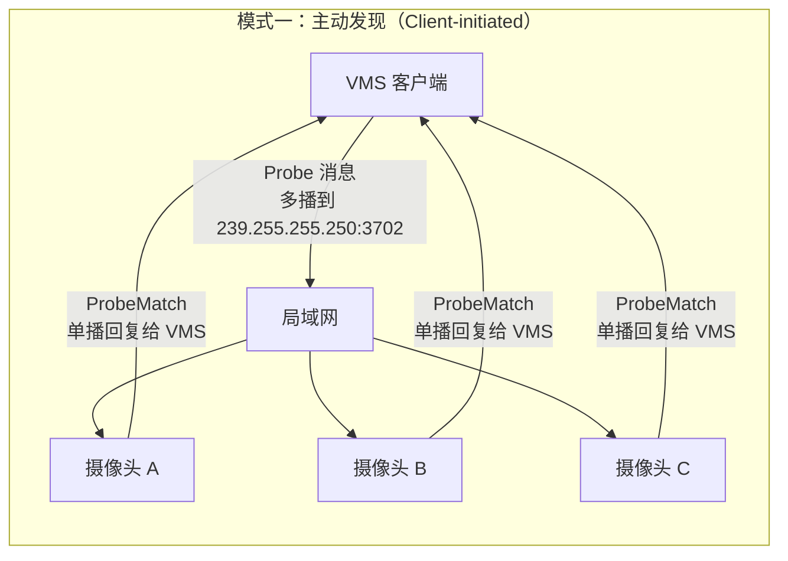

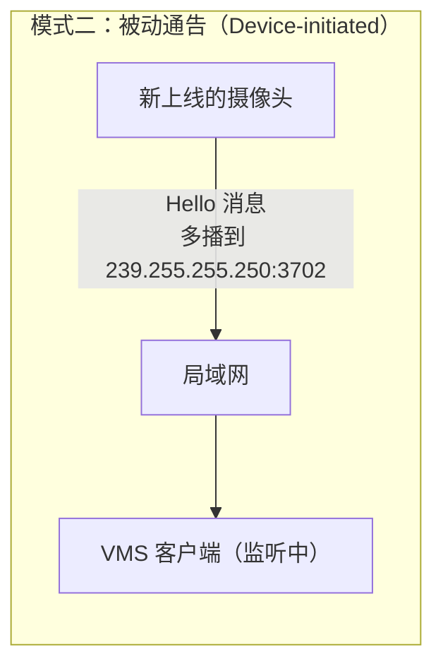

| 消息类型 | 发送方 | 接收方 | 触发时机 |
|---------|-------|-------|---------|
| **Hello** | 设备 | 多播组 | 设备上线时自动发送 |
| **Bye** | 设备 | 多播组 | 设备主动下线时发送 |
| **Probe** | 客户端 | 多播组 | 主动扫描时发送 |
| **ProbeMatch** | 设备 | 客户端（单播） | 响应 Probe，返回服务地址 |

### 3.3 Probe 报文解剖

下面是一个真实的 ONVIF WS-Discovery Probe 报文：

```xml
<?xml version="1.0" encoding="UTF-8"?>
<soap-env:Envelope
  xmlns:soap-env="http://www.w3.org/2003/05/soap-envelope"
  xmlns:a="http://schemas.xmlsoap.org/ws/2004/08/addressing">
  <soap-env:Header>
    <!-- WS-Addressing: 标识消息动作类型 -->
    <a:Action mustUnderstand="1">
      http://schemas.xmlsoap.org/ws/2005/04/discovery/Probe
    </a:Action>
    <!-- 每条消息的唯一 UUID，ProbeMatch 用 RelatesTo 引用它 -->
    <a:MessageID>uuid:a86f9421-b764-4256-8762-5ed0d8602a9c</a:MessageID>
    <a:ReplyTo>
      <a:Address>
        http://schemas.xmlsoap.org/ws/2004/08/addressing/role/anonymous
      </a:Address>
    </a:ReplyTo>
    <a:To mustUnderstand="1">
      urn:schemas-xmlsoap-org:ws:2005:04:discovery
    </a:To>
  </soap-env:Header>
  <soap-env:Body>
    <!-- 不指定 Types 和 Scopes，发现所有 ONVIF 设备 -->
    <Probe xmlns="http://schemas.xmlsoap.org/ws/2005/04/discovery"/>
  </soap-env:Body>
</soap-env:Envelope>
```

### 3.4 ProbeMatch 报文解剖

摄像头收到 Probe 后，以**单播**方式返回 ProbeMatch：

```xml
<env:Envelope xmlns:env="http://www.w3.org/2003/05/soap-envelope" ...>
  <env:Header>
    <wsadis:MessageID>urn:uuid:cea94000-fb96-11b3-8260-686dbc5cb15d</wsadis:MessageID>
    <!-- 引用 Probe 消息的 MessageID，建立请求-响应关联 -->
    <wsadis:RelatesTo>uuid:a86f9421-b764-4256-8762-5ed0d8602a9c</wsadis:RelatesTo>
    <wsadis:Action>
      http://schemas.xmlsoap.org/ws/2005/04/discovery/ProbeMatches
    </wsadis:Action>
  </env:Header>
  <env:Body>
    <d:ProbeMatches>
      <d:ProbeMatch>
        <!-- 设备端点的全局唯一标识 -->
        <wsadis:EndpointReference>
          <wsadis:Address>urn:uuid:cea94000-fb96-11b3-8260-686dbc5cb15d</wsadis:Address>
        </wsadis:EndpointReference>

        <!-- 设备类型：NetworkVideoTransmitter 表示 IP 摄像头 -->
        <d:Types>dn:NetworkVideoTransmitter tds:Device</d:Types>

        <!-- Scopes：设备的元数据，用 URI 格式表达 -->
        <d:Scopes>
          onvif://www.onvif.org/type/video_encoder
          onvif://www.onvif.org/Profile/Streaming
          onvif://www.onvif.org/Profile/G
          onvif://www.onvif.org/MAC/68:6d:bc:5c:b1:5d
          onvif://www.onvif.org/hardware/DS-2CD2T47G2-L
          onvif://www.onvif.org/location/building/server-room
        </d:Scopes>

        <!-- 核心！设备 Web Service 入口地址 -->
        <d:XAddrs>http://192.168.1.100:80/onvif/device_service</d:XAddrs>

        <!-- 元数据版本号，每次配置变化时递增 -->
        <d:MetadataVersion>1</d:MetadataVersion>
      </d:ProbeMatch>
    </d:ProbeMatches>
  </env:Body>
</env:Envelope>
```

### 3.5 Scopes 机制：精准过滤设备

Scopes 是以 `onvif://www.onvif.org/<category>/<value>` 格式表达的 URI，对于过滤和组织设备至关重要。客户端可以在 Probe 中指定 Scopes，只有匹配的设备才会响应。

常见的 Scope 类别：

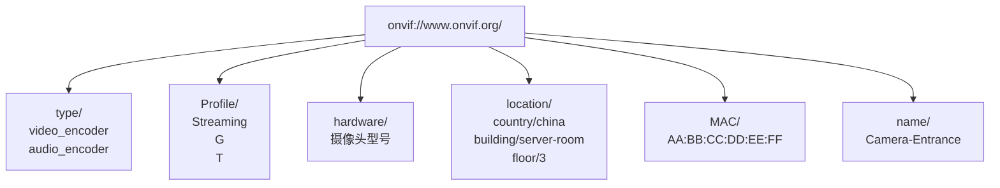

### 3.6 WS-Discovery 的状态机

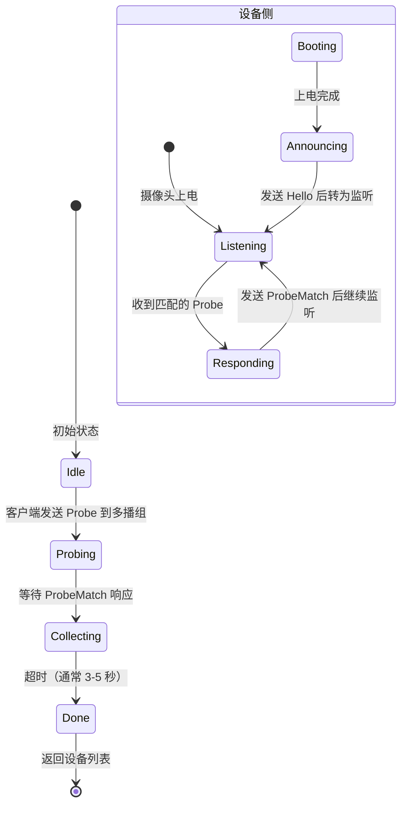

---

## 4. ONVIF 认证机制：从 WS-UsernameToken 到 HTTP Digest

发现设备、拿到服务地址之后，几乎所有的 ONVIF 服务调用都需要身份认证。ONVIF 支持两种认证机制。

### 4.1 认证机制一：WS-UsernameToken（SOAP 层认证）

WS-UsernameToken 是 OASIS（组织化信息标准促进组织）在 WS-Security 规范中定义的一种令牌认证机制，ONVIF 将其作为强制认证方式。

#### 4.1.1 PasswordDigest 算法

根据 ONVIF 应用程序员指南，密码不应以明文传输，而是生成 PasswordDigest。PasswordDigest 按照如下算法计算：

```
Digest = B64ENCODE( SHA1( B64DECODE(Nonce) + Date + Password ) )
```

其中：
- **Nonce**：客户端随机生成的唯一数值
- **Date**（Created）：请求时的 UTC 时间戳
- **Password**：该用户的密码


下面用伪代码展示完整计算过程：

```python
import hashlib, base64, os, datetime

def compute_password_digest(password: str) -> dict:
    # 1. 生成随机 Nonce（16 字节原始随机数）
    nonce_bytes = os.urandom(16)
    nonce_b64   = base64.b64encode(nonce_bytes).decode()  # 用于报文传输

    # 2. 获取当前 UTC 时间戳（ISO 8601 格式）
    created = datetime.datetime.utcnow().strftime('%Y-%m-%dT%H:%M:%SZ')

    # 3. 计算 Digest
    #    关键：Nonce 先 Base64 解码回二进制，再与 Created/Password 的 UTF-8 字节拼接
    raw = nonce_bytes + created.encode('utf-8') + password.encode('utf-8')
    digest = base64.b64encode(hashlib.sha1(raw).digest()).decode()

    return {
        'nonce':   nonce_b64,
        'created': created,
        'digest':  digest
    }
```

> **注意**：一个极其常见的实现错误是直接用 Base64 字符串拼接，而不是先对 Nonce 进行 Base64 **解码**。正确做法是：`SHA1(Base64解码后的Nonce字节 + Created的UTF8字节 + Password的UTF8字节)`。

#### 4.1.2 WS-UsernameToken SOAP 报文示例

```xml
<soap-env:Envelope xmlns:soap-env="http://www.w3.org/2003/05/soap-envelope"
                   xmlns:tds="http://www.onvif.org/ver10/device/wsdl">
  <soap-env:Header>
    <Security xmlns="http://docs.oasis-open.org/wss/2004/01/oasis-200401-wss-wssecurity-secext-1.0.xsd"
              mustUnderstand="1">
      <UsernameToken>
        <Username>admin</Username>
        <!-- Type 属性声明使用 PasswordDigest 而非明文 -->
        <Password Type="http://docs.oasis-open.org/wss/2004/01/oasis-200401-wss-username-token-profile-1.0#PasswordDigest">
          tuOSpGlFlIXsozq4HFNeeGeFLEI=
        </Password>
        <!-- Nonce Base64 编码传输 -->
        <Nonce EncodingType="http://docs.oasis-open.org/wss/2004/01/oasis-200401-wss-soap-message-security-1.0#Base64Binary">
          LKqI6G/AikKCQrN0zqZFlg==
        </Nonce>
        <!-- UTC 时间戳，设备用于检查时效性 -->
        <Created xmlns="http://docs.oasis-open.org/wss/2004/01/oasis-200401-wss-wssecurity-utility-1.0.xsd">
          2010-09-16T07:50:45Z
        </Created>
      </UsernameToken>
    </Security>
  </soap-env:Header>
  <soap-env:Body>
    <tds:GetProfiles/>
  </soap-env:Body>
</soap-env:Envelope>
```

#### 4.1.3 防重放攻击的三道防线

仅凭 PasswordDigest 不足以抵御重放攻击（攻击者截获合法报文后重复发送）。ONVIF 规范推荐三项反重放措施：

1. 建议设备拒绝任何未同时包含 Nonce 和时间戳的 UsernameToken
2. 建议设备设置时间戳时效限制，拒绝"陈旧"的 UsernameToken（指导值：5 分钟）
3. 建议设备缓存已使用的 Nonce，拒绝已出现在缓存中的重复 Nonce


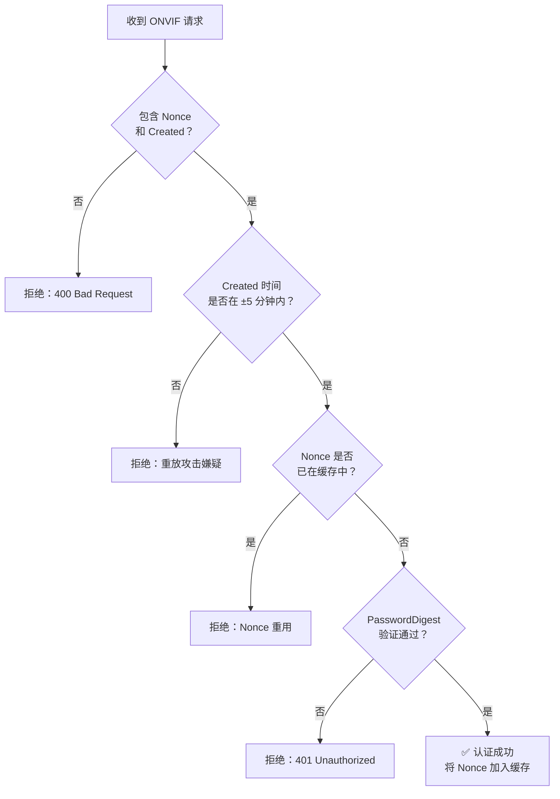

> **重要安全说明**：WS-UsernameToken 在没有 HTTPS 的情况下仍然存在明显的安全隐患——攻击者如果能嗅探未加密的 ONVIF 交互，就可以将截获的认证凭据用于重放攻击。强烈建议在生产环境中使用 HTTPS 传输 ONVIF 控制信令。

**时钟同步问题**：由于认证依赖时间戳，客户端和设备的时钟必须同步。在接入设备之前，通常需要先调用 `GetSystemDateAndTime` 获取设备时间，并用它来计算 Created 字段，以消除时钟偏差。

### 4.2 认证机制二：HTTP Digest 认证

HTTP Digest 认证是另一种支持的认证方式，定义于 RFC 7235 和 RFC 7616，基于标准的 HTTP 挑战-响应机制。

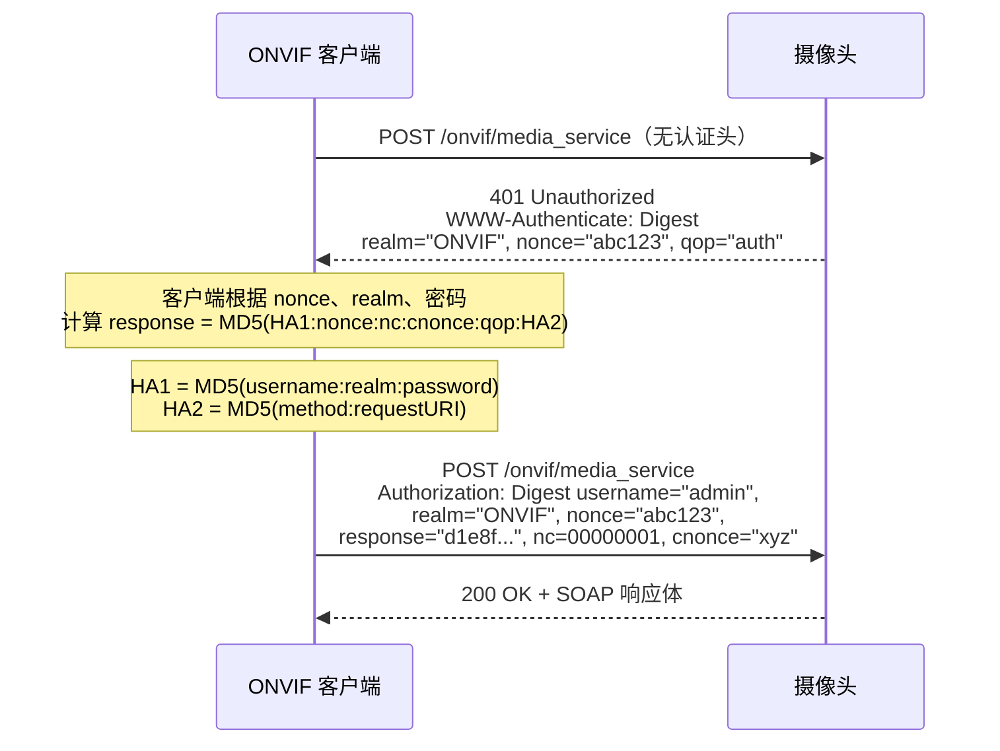

两种认证机制的对比：

| 维度 | WS-UsernameToken | HTTP Digest |
|------|-----------------|-------------|
| **层次** | SOAP Header（应用层） | HTTP Header（传输层） |
| **规范来源** | OASIS WS-Security | IETF RFC 7616 |
| **哈希算法** | SHA-1 | MD5（旧）/ SHA-256（新） |
| **防重放** | Nonce + Created | nonce + nc（计数器） |
| **需要时钟同步** | 是 | 否 |
| **ONVIF 强制性** | 早期版本强制 | 后期版本新增强制 |

---

## 5. RTSP 协议：多媒体流的"远程遥控器"

获取到 RTSP URI 之后，接入层需要通过 RTSP 协议建立媒体会话。RTSP 是整个视频流系统的控制枢纽。

### 5.1 RTSP 的历史与定位

RTSP 由 RealNetworks、Netscape 和哥伦比亚大学共同开发。1996 年 10 月 Netscape 和 Progressive Networks 向 IETF 提交了第一份草案，哥伦比亚大学的 Henning Schulzrinne 同年 12 月提交了"RTSP Prime"草案。

两份草案后来合并，经过在孟菲斯 IETF、慕尼黑 IETF 等多轮讨论，最终于 1998 年由 MMUSIC WG（多方多媒体会话控制工作组）发布为 RFC 2326。2016 年，RTSP 2.0 作为 RFC 7826 发布，取代了 RTSP 1.0。

RTSP 的定位需要特别强调：

> RTSP 建立并控制一路或多路时间同步的连续媒体流（如音视频），它本身通常不负责传输连续媒体流数据——换言之，RTSP 就是多媒体服务器的"网络远程控制器"。

这个比喻非常准确：RTSP 负责"按下播放"，而真正的视频数据由 RTP 协议传输。

### 5.2 RTSP 的核心方法（Method）

ONVIF 流式传输规范要求所有设备和客户端支持 RFC 2326 定义的 RTSP 用于会话初始化和播放控制，RTSP 使用 TCP 作为传输协议，默认端口为 554。

| 方法 | 方向 | 作用 | ONVIF 要求 |
|------|------|------|-----------|
| **OPTIONS** | C→S | 查询服务器支持的方法列表 | 可选 |
| **DESCRIBE** | C→S | 获取媒体流描述（SDP 格式） | **必须** |
| **SETUP** | C→S | 设置传输参数（端口、协议） | **必须** |
| **PLAY** | C→S | 开始播放媒体流 | **必须** |
| **PAUSE** | C→S | 暂停播放 | **必须** |
| **TEARDOWN** | C→S | 释放媒体会话 | **必须** |
| **GET_PARAMETER** | C↔S | 获取参数（常用于心跳保活） | 可选 |

### 5.3 RTSP 会话状态机

RTSP 维护严格的状态机，每个方法只在特定状态下合法：

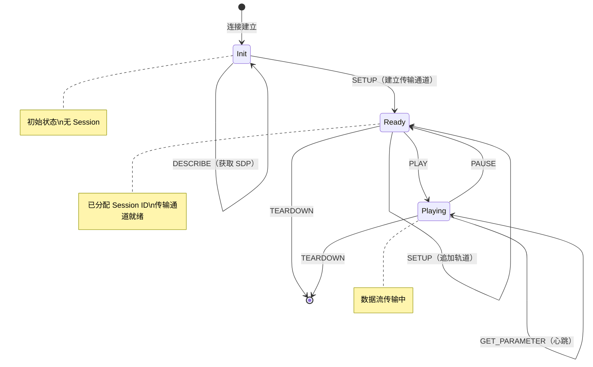

### 5.4 完整 RTSP 交互示例

下面是一次完整的 RTSP 会话，含真实报文格式（`CSeq` 是单调递增的序列号，用于匹配请求和响应）：

**步骤 1：DESCRIBE — 获取媒体描述**

```
C→S: DESCRIBE rtsp://192.168.1.100:554/live/main RTSP/1.0
     CSeq: 1
     Accept: application/sdp

S→C: RTSP/1.0 200 OK
     CSeq: 1
     Content-Type: application/sdp
     Content-Base: rtsp://192.168.1.100:554/live/main/
     Content-Length: 468

     v=0
     o=- 1234567890 1234567890 IN IP4 192.168.1.100
     s=HIKVISION Network Camera
     t=0 0
     a=control:rtsp://192.168.1.100:554/live/main
     m=video 0 RTP/AVP 96
     a=rtpmap:96 H264/90000
     a=fmtp:96 packetization-mode=1; profile-level-id=640028;
       sprop-parameter-sets=Z2QAKKwbGoB4AAAbAAADAGQAAFnoAA==,aOvNyyA=
     a=control:trackID=1
     m=audio 0 RTP/AVP 8
     a=rtpmap:8 PCMA/8000
     a=control:trackID=2
```

**步骤 2：SETUP — 为每个轨道设置传输参数**

```
C→S: SETUP rtsp://192.168.1.100:554/live/main/trackID=1 RTSP/1.0
     CSeq: 2
     Transport: RTP/AVP;unicast;client_port=50000-50001

S→C: RTSP/1.0 200 OK
     CSeq: 2
     Session: 6B8B4567          ← 分配 Session ID
     Transport: RTP/AVP;unicast;
                client_port=50000-50001;
                server_port=8854-8855  ← 服务端 RTP/RTCP 端口
```

**步骤 3：PLAY — 开始播放**

```
C→S: PLAY rtsp://192.168.1.100:554/live/main RTSP/1.0
     CSeq: 3
     Session: 6B8B4567
     Range: npt=now-          ← 从当前时间开始（实时流）

S→C: RTSP/1.0 200 OK
     CSeq: 3
     Session: 6B8B4567
     RTP-Info: url=rtsp://192.168.1.100:554/live/main/trackID=1;
               seq=12345;rtptime=2890844526
     ← 之后摄像头开始持续发送 RTP 数据包
```

**步骤 4：TEARDOWN — 断开会话**

```
C→S: TEARDOWN rtsp://192.168.1.100:554/live/main RTSP/1.0
     CSeq: 4
     Session: 6B8B4567

S→C: RTSP/1.0 200 OK
     CSeq: 4
     Session: 6B8B4567
```

---

## 6. RTP 与 SDP：媒体数据的传输与描述

### 6.1 协议栈的分工

RTSP 只是控制平面，真实的视频数据通过 **RTP（Real-time Transport Protocol，实时传输协议）** 传输：

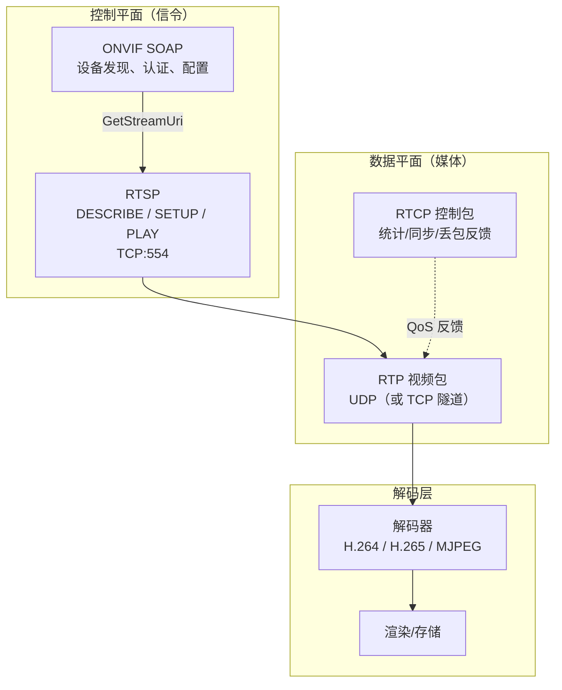

### 6.2 RTP 的传输模式

RTSP SETUP 阶段需要协商 RTP 的传输模式，主要有三种：

| 传输模式 | SETUP Transport 字段 | 特点 |
|---------|---------------------|------|
| **UDP 单播** | `RTP/AVP;unicast;client_port=P-P+1` | 低延迟，但 NAT/防火墙穿透困难 |
| **UDP 多播** | `RTP/AVP;multicast;port=P-P+1` | 一对多，节省带宽，仅限局域网 |
| **TCP 隧道** | `RTP/AVP/TCP;unicast;interleaved=0-1` | 稳定穿透 NAT，略有延迟，推荐用于广域网 |

ONVIF 流式传输规范明确要求服务端支持 RTP/RTSP/HTTP/TCP 传输模式。对于录像回放，建议客户端使用基于 TCP 的传输以实现可靠的媒体包交付。

**TCP 隧道（interleaved）模式**下，RTP/RTCP 数据包嵌入在 RTSP TCP 连接中传输，格式如下：

```
$[channel][2字节长度][RTP/RTCP数据]
  ↑
  固定的 $ 标识符（0x24）
  channel=0：RTP 视频
  channel=1：RTCP 视频控制
  channel=2：RTP 音频（如果有）
  channel=3：RTCP 音频控制
```

### 6.3 SDP：媒体描述的格式解析

SDP（Session Description Protocol，会话描述协议，RFC 4566）是 RTSP DESCRIBE 响应中包含的媒体描述格式。理解 SDP 是正确配置解码器的关键。

以一段真实的 H.264 摄像头 SDP 为例，逐字段解析：

```sdp
v=0                          ← SDP 版本（固定为 0）
o=- 1699000000 1 IN IP4 192.168.1.100  ← 会话发起者信息
s=IP Camera Stream           ← 会话名称
t=0 0                        ← 时间范围（0 0 = 永久有效）
a=control:*                  ← 整个会话的控制 URI

m=video 0 RTP/AVP 96        ← 媒体类型=video, 端口=0(由SETUP决定), 载荷类型=96
b=AS:4096                    ← 建议带宽 4096 kbps
a=rtpmap:96 H264/90000       ← 载荷96 = H264编码, 时钟频率 90000 Hz
a=fmtp:96 \
  packetization-mode=1;\     ← 分包模式: 1=Non-interleaved(推荐)
  profile-level-id=640028;\  ← H264 Profile(64=High) Level(0028=4.0)
  sprop-parameter-sets=Z2QAKKwbGoB4AAAbAAADAGQAAFnoAA==,aOvNyyA=
                              ↑ SPS 和 PPS 的 Base64，解码器初始化必需
a=control:trackID=0          ← 视频轨道控制 URI（用于 SETUP）

m=audio 0 RTP/AVP 0          ← 音频轨道，载荷类型 0
a=rtpmap:0 PCMU/8000         ← G.711 μ-law 编码，8kHz 采样率
a=control:trackID=1          ← 音频轨道控制 URI
```

> **解码关键**：`sprop-parameter-sets` 包含 H.264 的 SPS（Sequence Parameter Set）和 PPS（Picture Parameter Set），解码器必须在解码第一帧之前先处理这两个参数集。在 VMS 接入层代码中，提取并正确注入这两个参数集是正确解码 H.264 流的必要前提。

---

## 7. 完整接入流程：从零到拉流

将前面的所有知识点串联起来，下图展示了一个完整的摄像头接入流程：

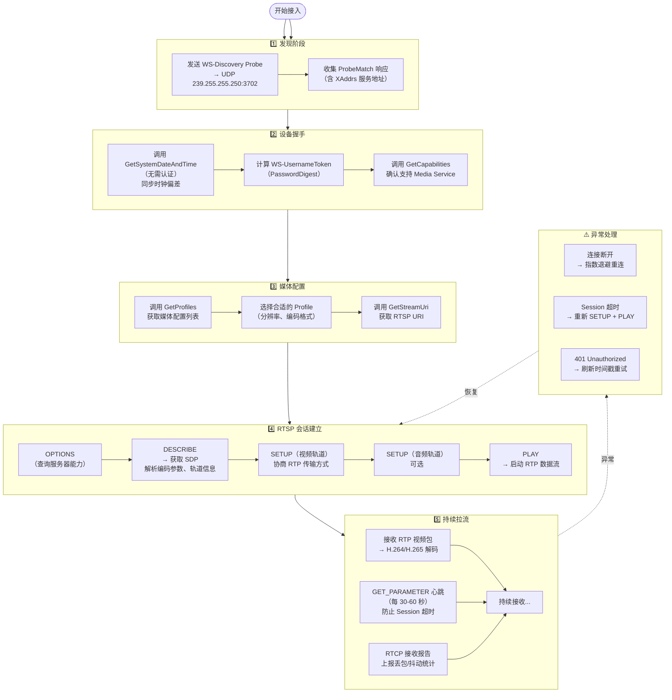

---

## 8. 工程实践：常见问题与调试方法

### 8.1 时钟不同步导致认证失败

**症状**：`401 Unauthorized`，即使密码正确。

**原因**：WS-UsernameToken 的 `Created` 时间戳超出设备的容差窗口（通常 ±5 分钟）。

**解决方案**：
```python
# 在每次认证前，先获取设备时间，计算偏差
device_time = call_GetSystemDateAndTime()
clock_offset = device_time - datetime.utcnow()

# 生成 Created 时使用修正后的时间
created = (datetime.utcnow() + clock_offset).strftime('%Y-%m-%dT%H:%M:%SZ')
```

### 8.2 RTSP 流在 NAT 后不通

**症状**：RTSP OPTIONS/DESCRIBE 正常，PLAY 之后收不到视频数据。

**原因**：UDP 方式的 RTP 包无法穿越 NAT，服务端不知道客户端的公网地址。

**解决方案**：使用 TCP 隧道模式（`RTP/AVP/TCP;interleaved`）：

```
SETUP rtsp://camera/stream RTSP/1.0
Transport: RTP/AVP/TCP;unicast;interleaved=0-1
```

### 8.3 WS-Discovery 跨 VLAN 不工作

**症状**：同一台机器可以直接访问摄像头 HTTP，但 ONVIF 工具发现不了摄像头。

**原因**：WS-Discovery 使用 UDP 多播，多播包默认不跨路由器/VLAN。

**解决方案**：
1. 配置三层交换机开启 IGMP Snooping 和多播路由
2. 部署 WS-Discovery Proxy（发现代理），代理负责跨网段转发探针
3. 放弃自动发现，采用手动输入 IP 方式配置摄像头

### 8.4 会话超时与心跳

RTSP 服务端有会话超时机制（通常 60~120 秒无活动则断开）。客户端需要定期发送心跳：

```
C→S: GET_PARAMETER rtsp://camera/stream RTSP/1.0
     CSeq: N
     Session: 6B8B4567
     Content-Type: text/parameters
     Content-Length: 0

S→C: RTSP/1.0 200 OK
     CSeq: N
     Session: 6B8B4567
```

### 8.5 调试工具推荐

| 工具 | 用途 |
|------|------|
| **Wireshark** | 抓包分析 WS-Discovery 多播、RTSP 信令、RTP 数据 |
| **ONVIF Device Manager** | Windows 下 ONVIF 设备发现与功能验证 |
| **ffmpeg** | `ffplay rtsp://user:pass@ip:554/stream` 快速验证 RTSP 流 |
| **VLC** | 打开 RTSP URL 调试视频流 |
| **Postman / SoapUI** | 手动构造 ONVIF SOAP 请求调试认证 |

调试 WS-Discovery 时，可用 Wireshark 过滤器：
```
udp.port == 3702
```

调试 RTSP 时：
```
tcp.port == 554 || udp.port == 554
```

---

## 9. 参考资料

1. **ONVIF Core Specification Ver. 25.12**. ONVIF. https://www.onvif.org/specs/core/ONVIF-Core-Specification.pdf

2. **ONVIF Streaming Specification Ver. 22.06**. ONVIF. https://www.onvif.org/specs/2206/ONVIF-Streaming-Spec-v2206.pdf

3. **ONVIF Application Programmer's Guide Version 1.0** (May 2011). ONVIF. https://www.onvif.org/wp-content/uploads/2016/12/ONVIF_WG-APG-Application_Programmers_Guide-1.pdf

4. H. Schulzrinne, A. Rao, R. Lanphier. **"Real Time Streaming Protocol (RTSP)"**. *RFC 2326*, IETF, April 1998. https://datatracker.ietf.org/doc/html/rfc2326

5. H. Schulzrinne et al. **"Real-Time Streaming Protocol Version 2.0"**. *RFC 7826*, IETF, December 2016. https://datatracker.ietf.org/doc/html/rfc7826

6. H. Schulzrinne, S. Casner, R. Frederick, V. Jacobson. **"RTP: A Transport Protocol for Real-Time Applications"**. *RFC 3550*, IETF, July 2003.

7. M. Handley, V. Jacobson, C. Perkins. **"SDP: Session Description Protocol"**. *RFC 4566*, IETF, July 2006.

8. OASIS. **"Web Services Security UsernameToken Profile Version 1.1"**. OASIS Standard, 2006. https://docs.oasis-open.org/wss/v1.1/wss-v1.1-spec-pr-UsernameTokenProfile-01.htm

9. *WS-Discovery (Web Services Dynamic Discovery)*. Wikipedia. https://en.wikipedia.org/wiki/WS-Discovery

10. Rainer Fischbach et al. **"Vulnerability in Dahua's ONVIF Implementation Threatens IP Camera Security"**. Nozomi Networks Labs, 2022. https://www.nozominetworks.com/blog/vulnerability-in-dahua-s-onvif-implementation-threatens-ip-camera-security

11. **"The History of ONVIF"**. IFSEC Insider. https://www.ifsecglobal.com/video-surveillance/a-potted-history-of-onvif/

12. **"ONVIF Milestones Through the Years"**. ONVIF Blog, 2021. https://www.onvif.org/blog/2021/03/30/onvif-milestones-through-the-years/

13. **EdgeX Foundry Documentation: ONVIF User Authentication**. https://docs.edgexfoundry.org/3.0/microservices/device/supported/device-onvif-camera/supplementary-info/onvif-user-authentication/

---

> **写在最后**：摄像头接入层看似是"对接几个接口"的简单工作，但其背后涉及从局域网多播协议（WS-Discovery）、Web Service 安全规范（WS-Security）、应用层控制协议（RTSP）到实时传输协议（RTP）的完整知识体系。每一层都有精心设计的权衡取舍，理解这些设计背后的"为什么"，才能在遇到问题时快速定位根因，而不是面对一个 `401 Unauthorized` 或"收不到视频流"束手无策。
