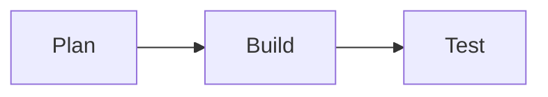

## 你将学到什么
- 何时使用 Tabs（多语言/多方案）。
- 何时使用 Steps（流程化任务）。

## Tabs 示例
::: tabs
@tab TypeScript
```ts
console.log("Hello TypeScript")
```

@tab Rust
```rust
fn main() {
  println!("Hello Rust");
}
```
:::

## Steps 示例
:::: steps
- 拉取代码
- 安装依赖
- 本地运行
- 打包发布
::::

## Demo 同屏示例
[demo title="Mermaid 演示" lang="mermaid" mode="split" result="auto"]

预览区自动渲染，源码区保留原始代码。
[/demo]

## 效果验证
- Tab 切换顺畅。
- Steps 编号和样式正确。

## 常见问题与排查
- Tabs 没有样式：检查 `markdown.extended.tabs.enable`。

## 下一篇预告
下一篇进入图表与流程图能力。
