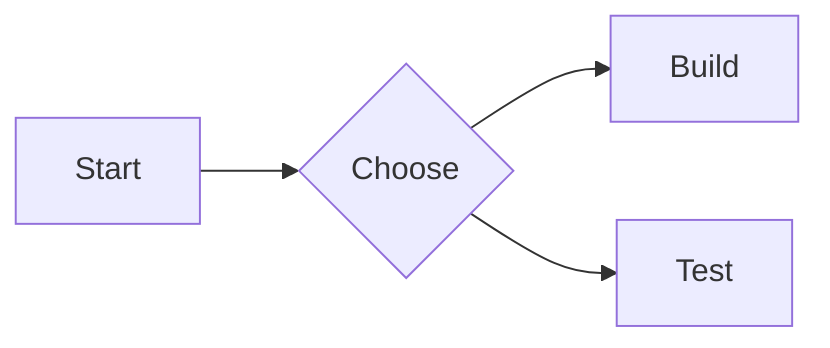

## 你将学到什么
- 四类图形能力的适用场景。
- 各能力的配置开关与最小示例。

## 相关配置
```ts
features: { diagram: { mermaid: true, drawio: true, echarts: true } },
diagram: {
  fallbackToCdn: true,
  mermaid: { source: "cdn" },
  drawio: { viewerBase: "https://viewer.diagrams.net" },
  echarts: { source: "cdn", defaultHeight: 360 }
},
markdown: { extended: { chartjs: { enable: true } } }
```

## Mermaid


## Draw.io
```drawio
https://example.com/your-diagram.drawio
```

## ECharts
```chart
{
  "xAxis": { "type": "category", "data": ["A", "B", "C"] },
  "yAxis": { "type": "value" },
  "series": [{ "type": "line", "data": [3, 9, 5] }]
}
```

## Chart.js
::: chartjs 请求趋势
```json
{
  "type": "bar",
  "data": {
    "labels": ["Mon", "Tue", "Wed"],
    "datasets": [{ "label": "Requests", "data": [120, 98, 140] }]
  }
}
```
图表说明：近三日请求量。
:::

## 效果验证
- 图形正常渲染，无空白容器。
- 断网时回退逻辑符合预期。

## 常见问题与排查
- Draw.io 空白：检查 URL 可访问性。
- 图表未渲染：检查 bundle 加载与 JSON 格式。

## 下一篇预告
下一篇讲数学公式复制与行内图标。
